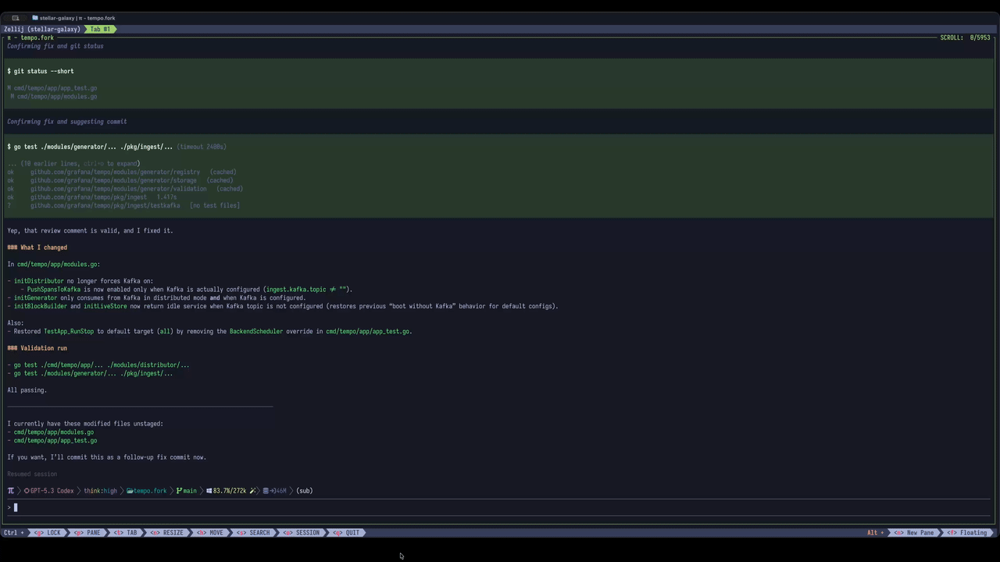

# pi-zellij

Pi package with [zellij](https://zellij.dev)-powered terminal integrations for [Pi](https://pi.dev). Make your workflow agent driven.

## Workflow



## Why

[Pi](https://pi.dev) works well in the terminal, but pane orchestration is better handled by a terminal multiplexer. `pi-zellij` adds zellij-native split workflows for Pi.

It includes split and tab commands, generic tool launchers, settings-driven floating app shortcuts, opt-in pane highlighting for completed agent turns, and quick Pi split commands.

## Usage

Install with pi:

```bash
pi install npm:pi-zellij
```

Or with the installer:

```bash
npx pi-zellij
```

If pi is already running, use:

```text
/reload
```

## Requirements

- `zellij` must be installed
- pane, tab, and floating commands must be run from inside an active zellij session

### Recommended zellij version

| zellij version | status | notes |
| --- | --- | --- |
| `0.44.0+` | recommended | `pi-zellij` can show created pane/tab IDs in success notifications, and `/zt` can launch its initial command directly via `zellij action new-tab -- <command>` |
| older versions | supported with fallback | commands still work, but zellij may not expose created IDs and `/zt` may fall back to the older typed-input startup path |

## Feature overview

### Pane and tab workflows

- `/zv`, `/zj`, `/zt`
  - start a fresh Pi session in a new right pane, lower pane, or tab
- `/zo <command...>`, `/zoh <command...>`
  - run any shell command in a new right pane or lower pane

### Floating tools

- `pi-zellij.commands` in `settings.json`
  - registers floating app shortcuts such as `/zh` for `hx` or `/zg` for `lazygit`
- `pi-zellij.paneHighlight` in `settings.json`
  - optionally tints the current zellij pane when Pi finishes a turn and is waiting for input

### Quick Pi splits

- `/zcv`, `/zch`
  - open Pi in a split using the same working directory

## Bundled extensions and resources

Extensions:
- `zv-split`
- `zv-open`
- `zv-highlight`
- `zv-continue`

## Commands

### Split and tab commands

- `/zv`
  - opens a new pane to the right
  - starts a fresh `pi` session in the same `cwd`
- `/zj`
  - opens a new pane below
  - starts a fresh `pi` session in the same `cwd`
- `/zt`
  - opens a new zellij tab
  - starts a fresh `pi` session in the same `cwd`

All three commands also accept optional initial prompt text.

Examples:

```text
/zv Review the auth flow in this repo
/zt Investigate flaky tests in this repo
```

### Tool split commands

- `/zo <command...>`
  - opens a new pane to the right
  - runs the given shell command in the same `cwd`
- `/zoh <command...>`
  - opens a new pane below
  - runs the given shell command in the same `cwd`

Examples:

```text
/zo hx
/zo npm test
/zoh npm run dev
/zo watch -n 1 git status --short
```

Commands are executed via `sh -lc` in the current project directory.

### Configured floating commands

You can register your own floating app shortcuts in Pi's main settings file under `pi-zellij.commands`.

Supported locations:
- `~/.pi/agent/settings.json` for global commands
- `.pi/settings.json` for project-local commands

During the rename from `pi-zv` to `pi-zellij`, legacy `pi-zv.commands` is still accepted for compatibility. If both keys exist, `pi-zellij.commands` wins.

Simple form:

```json
{
  "pi-zellij": {
    "commands": {
      "zh": "hx",
      "zg": "lazygit"
    }
  }
}
```

Each configured command opens in a floating zellij pane using a default `90%` by `90%` popup with `5%` margins.

Examples:

```text
/zh
/zg
```

For commands that should accept extra arguments, use the object form.

Helix and lazygit example:

```json
{
  "pi-zellij": {
    "commands": {
      "zh": {
        "run": "hx",
        "acceptArgs": true,
        "description": "Open Helix in a floating pane"
      },
      "zg": {
        "run": "lazygit",
        "description": "Open lazygit in a floating pane"
      }
    }
  }
}
```

Then you can use:

```text
/zh
/zh src/auth.ts
/zg
```

Configured command names cannot reuse built-in Pi commands such as `/settings`, `/model`, or `/reload`, and they also cannot replace pi-zellij's own slash commands such as `/zv`, `/zj`, `/zt`, or `/zcv`.

If the same command exists in both global and project settings, the project setting wins. After changing settings, run `/reload` in Pi.

### Pane highlight on completion

You can optionally tint the current zellij pane when Pi finishes a turn and is waiting for input.

Supported locations:
- `~/.pi/agent/settings.json` for global settings
- `.pi/settings.json` for project-local settings

During the rename from `pi-zv` to `pi-zellij`, legacy `pi-zv.paneHighlight` is still accepted for compatibility. If both keys exist, `pi-zellij.paneHighlight` wins.

Minimal form:

```json
{
  "pi-zellij": {
    "paneHighlight": true
  }
}
```

That enables a default done-state background tint. The feature is zellij-only and does nothing outside an active zellij session.

Object form:

```json
{
  "pi-zellij": {
    "paneHighlight": {
      "enabled": true,
      "doneBg": "#17352a",
      "doneFg": "#e7fff0",
      "workingBg": "#2f2415"
    }
  }
}
```

Supported keys:
- `enabled`
  - set to `false` to disable the feature
- `doneBg`, `doneFg`
  - pane colors to apply after `agent_end` when the pane is not currently focused
- `workingBg`, `workingFg`
  - optional pane colors to apply while Pi is working; if omitted, `pi-zellij` resets the pane to its default colors when the next input is submitted or when the pane is focused again after being elsewhere

When enabled, `pi-zellij` resets the pane color on session start, session switch, the next submitted input, pane refocus when zellij focus state is available, and session shutdown so completed-turn highlights do not linger across sessions. If the pane is already focused when a turn completes, the done-state tint is skipped so the Pi editor does not stay tinted while you type. Aborted runs do not apply the done-state tint. After changing these settings, run `/reload` in Pi.

### Quick Pi split commands

- `/zcv`
  - opens a new pane to the right
  - starts `pi` in the same `cwd`
- `/zch`
  - opens a new pane below
  - starts `pi` in the same `cwd`

These commands do not create session files, prompts, summaries, or git worktrees.

Examples:

```text
/zcv
/zch
```


